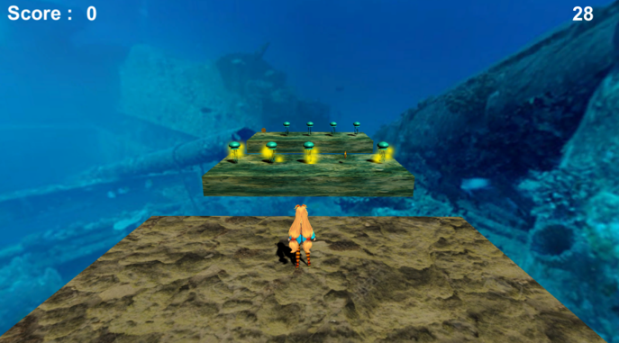
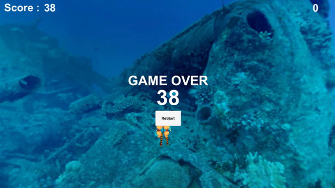

# Avoid_Obstacles_Game
> 학부생 3학년 2학기 때 유니티3D를 사용하여  개발한 장애물 피하기 게임

## 개발기간
* 2019.10.05.~2019.11.23. (약2개월)

## 주요 기능
* 유니티 게임엔진을 이용한 장애물 피하기 게임 개발
* 게임 배경은 3D 해저 이미지 사용

## 특이사항
* IoT스마트메이커스 교육 프로그램에서 수행함
* '바닷속에서 장애물을 피해 나아간다'는 기획된 스토리를 게임으로 구현함

## Development setup
* Unity3D 2019

## Release History

* 1.0.0
    * first
    * 개발 완료

## Contact

김준혁 – kimjunhyeok.it@gmail.com
